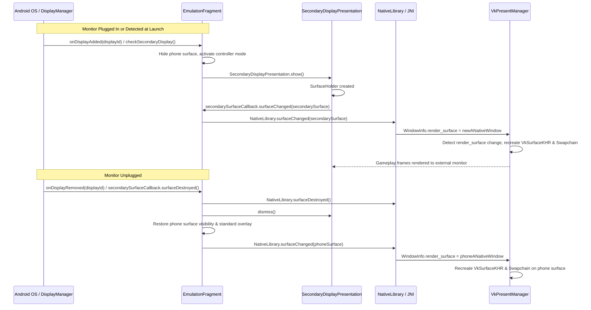

# Secondary Display & Virtual Controller Casting

## Overview

This feature allows the Android build of Eden to automatically detect secondary monitors (connected via USB-C DisplayPort Alt Mode, HDMI adapter, wireless casting, or AR glasses) and dynamically cast the gameplay rendering to the external display while transforming the phone screen into a dedicated virtual gamepad controller.

This workflow mimics dual-screen handheld and docked experiences (such as Azahar for 3DS or docked Switch mode):
* **External Display**: Renders the Switch emulation video in full screen, maintaining proper aspect ratios (16:9, 21:9, etc.) without system navigation bars.
* **Phone Screen**: Hides the game render surface and displays an interactive, high-contrast virtual gamepad with joypad sticks, D-pad, and action buttons.

---

## Architecture & System Flow

---

## Component Details

### 1. Presentation & Surface Management
* **`SecondaryDisplayPresentation.kt` (`org.yuzu.yuzu_emu.presentation`)**:
  * Inherits from `android.app.Presentation`.
  * Instantiated with the secondary `Display` object obtained from `DisplayManager.DISPLAY_CATEGORY_PRESENTATION` (or any non-default display).
  * Hosts a `FixedRatioSurfaceView` wrapped in a black container.
  * Enforces immersive full-screen display by hiding Android system navigation and status bars using `WindowInsetsControllerCompat`.
  * Applies `FLAG_KEEP_SCREEN_ON` to prevent the external screen from timing out.
  * Adjusts the `FixedRatioSurfaceView` aspect ratio according to user settings (`RENDERER_ASPECT_RATIO`).

* **`presentation_secondary_display.xml` (`res/layout`)**:
  * Layout definition containing the `FixedRatioSurfaceView` centered on a black background.

### 2. Emulation Fragment Orchestration (`EmulationFragment.kt`)
* **Display Lifecycle Listener**:
  * Registers a `DisplayManager.DisplayListener` in `completeViewSetup()` to handle hot-plug events (`onDisplayAdded`, `onDisplayRemoved`).
  * Unregisters cleanly during `onDestroyView()`.
  * Manages `onStart()` / `onStop()` / `onResume()` to dismiss or restore presentations across activity lifecycle transitions.
* **Surface Callback Shielding**:
  * When `isSecondaryDisplayActive` is true, the phone's primary `surfaceEmulation` is marked `View.INVISIBLE`.
  * The destruction of the phone's local surface is intercepted in `surfaceDestroyed()` and intentionally ignored so `EmulationState` does not pause emulation or destroy native pipelines.
  * When the secondary display disconnects, `isSecondaryDisplayActive` is reset to false, the phone's `surfaceEmulation` is set back to `View.VISIBLE`, and its `surfaceChanged` callback updates `EmulationState.updateSurfaceReference()`, returning rendering to the phone.

### 3. Dedicated Phone Virtual Controller (`InputOverlay.kt`)
* **Controller Mode (`isSecondaryDisplayMode`)**:
  * When secondary display casting is active, the phone's emulation container background is tinted black (`#000000`) to provide a clean controller appearance.
  * The onscreen `InputOverlay` is brought to the front and forced visible (`setVisible(true)`).
  * Auto-hide overlay timers and hide-on-controller-input behaviors are suspended while secondary display mode is active.
  * In `onTouch()`, raw touchscreen input pass-through to the guest Switch is suppressed, preventing unintended touch points on the external screen.

### 4. Native Surface Swapping & Vulkan Presenter
* **`native.cpp` (JNI Layer)**:
  * Updated `EmulationSession::SetNativeWindow(ANativeWindow* native_window)` to safely release any existing `ANativeWindow` references before storing the new handle, preventing memory and display surface leaks.
  * Updated `Java_org_yuzu_yuzu_1emu_NativeLibrary_surfaceDestroyed` to clear the native window pointer (`SetNativeWindow(nullptr)`) and invoke `SurfaceChanged()`, resetting `window_info.render_surface = nullptr`.
* **`vk_present_manager.h` & `vk_present_manager.cpp` (Vulkan Backend)**:
  * Added `last_render_surface` tracking on Android.
  * In `CopyToSwapchain(Frame* frame)`:
    * Compares `render_window.GetWindowInfo().render_surface` against `last_render_surface`.
    * If `render_surface` transitions to null, frame presentation is safely bypassed until a valid surface is restored.
    * If `render_surface` changes to a new `ANativeWindow` (such as transitioning between phone screen and secondary monitor), triggers `surface = CreateSurface(instance, ...)` and `RecreateSwapchain(frame)`.
    * Ensures zero tearing, no deadlocks, and seamless swapchain recreation across display transitions.

### 5. Settings Configuration
* Added boolean setting `use_secondary_display` (key `"use_secondary_display"`), enabled by default:
  * Native definition: `android_settings.h` (`Settings::Category::Android`).
  * Kotlin binding: `BooleanSetting.USE_SECONDARY_DISPLAY`.
  * Settings UI: `SettingsItem.kt` under Display Settings.
  * Fragment Presenter: `SettingsFragmentPresenter.kt`.
  * Localized strings in `strings.xml`.

---

## File Changes Summary

| File | Status | Description |
| :--- | :---: | :--- |
| `src/android/app/src/main/java/org/yuzu/yuzu_emu/presentation/SecondaryDisplayPresentation.kt` | Added | Android `Presentation` implementation hosting the secondary surface. |
| `src/android/app/src/main/res/layout/presentation_secondary_display.xml` | Added | Layout XML for secondary monitor presentation window. |
| `src/android/app/src/main/java/org/yuzu/yuzu_emu/fragments/EmulationFragment.kt` | Modified | Added DisplayManager listener, secondary presentation lifecycle, overlay enforcement, and surface transition handlers. |
| `src/android/app/src/main/java/org/yuzu/yuzu_emu/overlay/InputOverlay.kt` | Modified | Added `isSecondaryDisplayMode` flag, forced control drawing, and touchscreen filter. |
| `src/android/app/src/main/jni/android_settings.h` | Modified | Added `use_secondary_display` setting definition. |
| `src/android/app/src/main/jni/native.cpp` | Modified | Safe `ANativeWindow` replacement/release and surface nullification. |
| `src/video_core/renderer_vulkan/vk_present_manager.h` | Modified | Added `last_render_surface` tracker. |
| `src/video_core/renderer_vulkan/vk_present_manager.cpp` | Modified | Dynamic Vulkan surface and swapchain recreation on render surface change. |
| `src/android/app/src/main/java/org/yuzu/yuzu_emu/features/settings/model/BooleanSetting.kt` | Modified | Registered `USE_SECONDARY_DISPLAY` setting enum. |
| `src/android/app/src/main/java/org/yuzu/yuzu_emu/features/settings/model/view/SettingsItem.kt` | Modified | Registered UI switch item for secondary display setting. |
| `src/android/app/src/main/java/org/yuzu/yuzu_emu/features/settings/ui/SettingsFragmentPresenter.kt` | Modified | Placed secondary display setting under Display section. |
| `src/android/app/src/main/res/values/strings.xml` | Modified | Added English title and description strings. |

---

## Edge Cases Handled

1. **Pre-connected Display**: If a monitor or AR glasses are already connected when the game starts, the secondary presentation initializes immediately, launching the game directly onto the external screen without creating an unused phone surface.
2. **Dynamic Hot-Plugging**: Plugging in a display mid-game migrates rendering seamlessly to the external screen; unplugging returns gameplay immediately to the phone display without crashing or pausing.
3. **Orientation Handling**: Rotating the phone while casting adjusts the virtual gamepad layout (Portrait vs. Landscape) on the phone screen without affecting the fixed landscape rendering on the external monitor.
4. **Physical Controller Interaction**: If a physical controller is connected, the onscreen gamepad remains available on the phone unless explicitly turned off by the user.
5. **App Suspension / Picture-in-Picture**: Suspending or backgrounding the activity dismisses the presentation cleanly, preventing Android `BadTokenException` errors or orphan windows.
